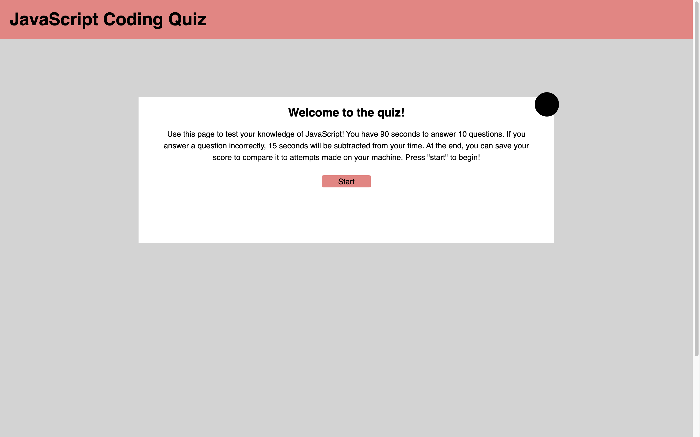

# Coding Quiz (Module 04 Homework - Web API)

The goal was to create a JavaScript Coding Quiz from scratch. The requirements were:
- The webpage features CSS and HTMl that are updated by the JS code.
- The webpage starts the quiz with a start button.
- A timer starts when the quiz is started.
- When a question is answered, a new question is displayed.
- When a question is answered incorrectly, time is subtracted from the timer (15 seconds in this webpage).
- The game is over when every question is answered or the timer reaches 0.
- When the game is over, the user can save their initials and score.
- The user can see previous scores to compare their progress with their peers.

 

## Visual Example

---

)

 

## Working Version

---

[Link to Deployed Version](https://a-down.github.io/code-quiz/)